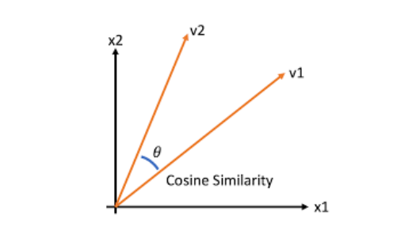
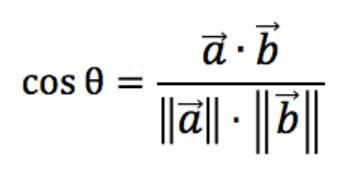
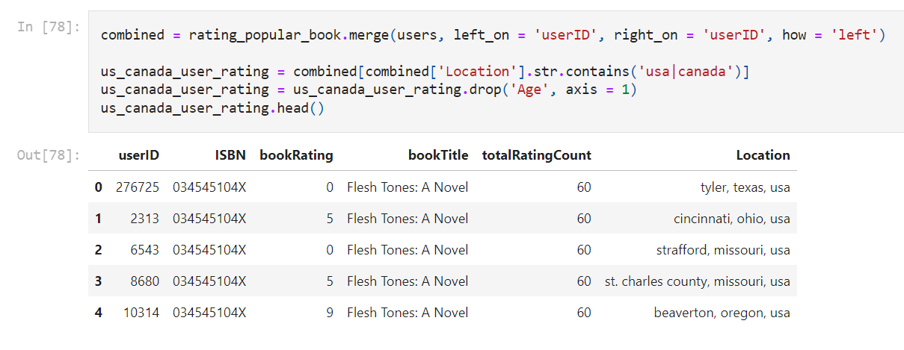
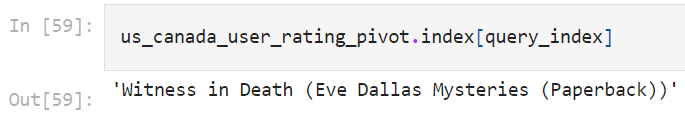
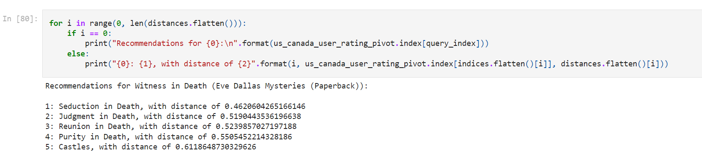

<h1 align="center"> Minor Project Mid Term Progress Report </h1>

 (2022, Group 22) 

<h2 align="center"> BOOK RECOMMENDATION ENGINE </h2> 
<h3 align="center"> Submitted in partial fulfilment of the requirements for the award of the degree of </h3>

<h2 align="center"> Bachelor of Technology </h2> 
<h2 align="center"> In </h2> 
<h2 align="center"> Computer Science and Engineering </h2>

    

    <h2 align="center"> Submiited By :- </h2>
    <h3 align="center"> Konark Lohat (1905801) </h3>
    <h3 align="center"> Gautam Jain (1905785) </h3>
    <h3 align="center"> Jaskamal Singh (1905006) </h3>
    <h3 align="center"> <strong> Guru Nanak Dev Engineering College Ludhiana - 141006 </strong> </h3>
    

<!-- Index -->
<h2 align="center"> Index </h2> 

    

 
 

<!-- Introduction -->
<h2 align="center"> 1. INTRODUCTION </h2>

     A recommendation engine based on dynamic content, further classified or categorized into content-based (milestone 1) or neighborhood-based collaborative learning (milestone 2) by using matrix factorization methods and other algorithms used in a recommendation system.

    The content will be recommended on various factors and in a better / optimized  way.

    A Book Recommendation Engine Based on Collaborative Filtering Concept using K Nearest Neighbors algorithm to recommend book based on the books liked by other readers and their corresponding ratings (ranking system).

     Based on the reading provided by all the readers books are recommended to the users based on the users they follow and their liked books.

    The Collaborative Filtering System is established using the cosine similarity relation between ratings and the recommendations with maximum match are returned.

<h3 align="center"> 1.1 Objectives </h3> 
<ul>
    <strong>- Implementing neighborhood based collaborative filtering (KNN Cosine similarity).</strong>
     
    <strong>- Creating a framework for recommendation engine/system.</strong>
     
    <strong>- Implementing Content-based filtering.</strong>
</ul>

<h3 align="center"> 1.2 Technology used </h3>

    <strong>Python</strong> – Python is an interpreted general-purpose high-level language. Created by Guido van Rossum and first released in 1991, Python’s design philosophy emphasizes code readability with its notable use of significant whitespace. Its language constructs and object-oriented approach aim to help programmers write clear, logical code for small and large-scale projects.

<!--     1. **MongoDB** – MongoDB is an open-source leading NoSQL and document-based database. MongoDB is written in C++. MongoDB handles large volumes of data at high speed with a scale-out architecture. Store unstructured, semi-structured, or structured data. Enable easy updates to schemas and fields. Developer-friendly. Take full advantage of the cloud to deliver zero downtime. -->

    <strong>ML/AI</strong> – Machine learning is a subfield of artificial intelligence (AI). The goal of machine learning generally is to understand the structure of data and fit that data into models that can be understood and utilized by people.

    <strong>Git</strong> – Git is an open-source version control system. It was designed and developed by Linus Torvalds (creator of the Linux kernel) and is the most popular version control system to date.

 
 

<!-- System Requirements -->
<h2 align="center"> 2. SYSTEM REQUIREMENTS </h2>

<h3> 2.1 Hardware Requirements </h3>

- Windows 10+ / Linus / Mac Operating System
- i5 8 Gen+
- 4+ GB RAM
- Dual Core processor.

<h3> 2.2 Software Requirements </h3>

- Python 3.6+ installed
- Python Packages (like NumPy, pandas, matplotlib etc.)
- Seaborn

 
 

<!-- Software Requirement Analysis -->

<h2 align="center"> 3. SOFTWARE REQUIREMENT ANALYSIS </h2>

    Most of the recommendation systems used nowadays in big companies/products are not open source. Pushing these technologies like a recommendation engine to be an open-source product creates more horizons for beginners in ML/AI and also to make optimised and accurate recommendations.

    
This recommendation engine can be used by system architectures to make fast and reliable integration of AI in their application/system. To create a high open-source impact, the reliable scalability design of the recommendation engine has been given proper consideration.

    Recommender systems help the users to get personalised recommendations, make correct decisions in their online transactions, increase sales and redefine the user's web browsing experience, retain the customers, enhance their shopping experience, etc. The information overload problem is solved by search engines, but they do not provide the personalization of data. 

    Recommendation engines provide personalization. There are different types of recommender systems such as content-based, collaborative filtering, hybrid recommender system, demographic, and keyword-based recommender systems. A variety of algorithms are used by various researchers in each type of recommendation system.

 
 

<!-- Litreature -->
<h2 align="center"> 4. LITREATURE </h2>

1. **Google Developers Community [1]:** Recommendation System by Google Developers Platforms

   - Proposed Learnings:
   - Describe the purpose of recommendation systems.
   - Understand the components of a recommendation system including candidate generation, scoring, and re-ranking.
   - Develop a deeper technical understanding of common techniques used in candidate generation.
   - Use TensorFlow to develop models used for recommendation.

2. **Joeran Beel et al. [2]:** [Research-paper recommender systems: a literature survey](https://d-nb.info/1147681678/34)

   - This paper has introduced recommender systems to new research. This paper has also identified key problems which need research in recommender systems.
   - This paper can help Ph.D. and Master's students in choosing their area of research. The research gap is already presented in this paper to form different problems of recommender systems.
   - The recommendation system finds its utility in major areas of web Applications. As these problems get solved more and more useful recommendation systems will become.

3. **Nitin Mishra et al. [3]:** [Research Problems in Recommender systems](https://iopscience.iop.org/article/10.1088/1742-6596/1717/1/012002/pdf)
   - It is a system that helps users to choose items that they may need. A Good Recommender System saves user’s time and keeps the user engaged in the system resulting in higher revenue.
   - Collaborative Filtering
   - Content-based
   - Hybrid Recommendation System

 
 

<!-- CODING / CORE MODULE -->
<h2 align="center"> 5. CODING / CORE MODULE </h2> 

      <h3><strong>1. KNN - Cosine Similarity</strong></h3>
      

        Cosine similarity is a metric used to determine how similar the documents are irrespective of their size. Cosine similarity among two objects measures         the angle of cosine between the two objects. It compares two documents on a normalized scale. It can be done by finding the dot product between the           two identities.
      

      
       
      <strong>(Fig. 1) Graph representation for cosine similarity between two vectors, v1 and v2</strong>
       
       
      
 
        As the above diagram shows, the angle between v1 and v2
        is. Lesser the angle between the two vectors more is the
        similarity. It means if the angle between two vectors is
        small, they are almost alike each other and if the angle
        between the two vectors is large then the vectors are very
        different from each other.
      

      
       
      <strong align="center">(Fig. 2) Cosine similarity mathematical formula</strong>
       
       
      <h3><strong>2. Collaborative Filtering</strong></h3>
      

        It depends upon the users who have similar interests and
        gives the result based on all the users.
        User-based: In user-based collaborative filtering, it is
        considered that a user will like the items that are liked by
        users with whom have comparable taste.
        Item-based: Item-based collaborative-filtering is
        different, it expects the users to like items that are
        related to items that he has liked earlier.
      

<h3><strong>3. Why cosine similarty metric?</strong></h3>
<ul>
    <li>
        The cosine similarity is beneficial because even if the two similar data objects are far apart by the Euclidean distance because of the size, they could still have a smaller angle between them. Smaller the angle, higher the similarity.
    </li>
    <li>
        When plotted on a multi-dimensional space, the cosine similarity captures the orientation (the angle) of the data objects and not the magnitude. 
    </li>
</ul>

 
 

<!-- PERFORMANCE / OUTPUT -->
<h2 align="center"> 6. PERFORMANCE / OUTPUT </h2>
<ul>
<li>After EDA, to improve the performance of the model on local systems, users from USA and Canada only were taken for the recommendations.

 
 
<li>Randomly selecting a book as a query for which similar books are recommended.</li>

 
 

<li>With respect to the above query cosine distance is calculated and instances (books) with the least distance is concluded and decided to be recommended to the users who have showed interest in original queried book.</li>

</ul>
 
 
 

<!-- Refrences -->
<h2 align="center"> 7. REFRENCES </h2>

**[1]** Google Developers Community (2020). Recommendation System by Google developers platforms. Link - https://developers.google.com/machine-learning/recommendation

**[2]** Joeran Beel, Bela Gipp, Stefan Langar, Corinna, Breitinger et al., 2016. Research-paper recommender systems: a literature survey. Journal on Digital Libraries. Link - https://d-nb.info/1147681678/3442-6596/1717/1/012002/pdf

**[3]** Nitin Mishra, Saumya Chaturvedi, Aanchal Vij, Sunita Tripathi et al., 2020. Research Problems in Recommender systems - Journal of Physics: Conference Series. Link - https://iopscience.iop.org/article/10.1088/1742-6596/1717/1/012002/pdf

 
 

<!-- ## Introduction
A Book Recommendation Engine Based on Collaborative Filtering Concept using K Nearest Neighbours algorithm to recommend book based on the books liked by other readers and their corresponding ratings (ranking system). -->
